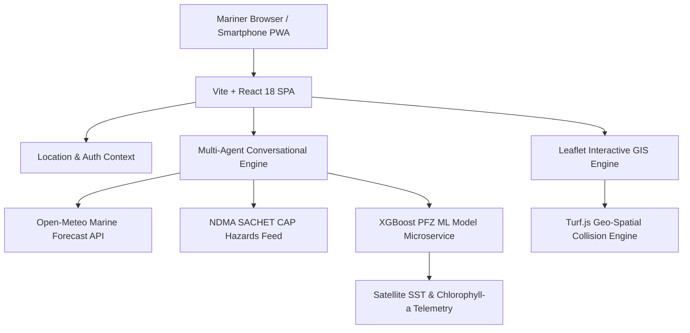

# 🌊 ORCA / MIRA — Marine Intelligence & Reasoning Agent
> **Conversational Marine Safety, Machine Learning Potential Fishing Zones (PFZ) & Safe Passage Routing for Indian Coastal Mariners.**

[](https://www.sih.gov.in/)
[](https://vercel.com)
[](https://reactjs.org/)
[](https://vitejs.dev/)
[](https://tailwindcss.com/)
[](https://leafletjs.com/)
[](https://fastapi.tiangolo.com/)

---

## 📖 Table of Contents
- [1. Overview & Problem Statement](#1-overview--problem-statement)
- [2. Key Features & Capabilities](#2-key-features--capabilities)
- [3. System Architecture](#3-system-architecture)
- [4. User Interface & Screen Walkthrough](#4-user-interface--screen-walkthrough)
- [5. Technology Stack](#5-technology-stack)
- [6. Quickstart Guide (Run Locally)](#6-quickstart-guide-run-locally)
- [7. Vercel Cloud Deployment](#7-vercel-cloud-deployment)
- [8. Security & Data Integrity](#8-security--data-integrity)
- [9. Project Structure](#9-project-structure)

---

## 1. Overview & Problem Statement

Coastal artisanal and mechanized fishermen in India frequently face unpredictable sea conditions, extreme swell surges, shifting fish aggregations, and maritime hazard perimeters without unified, real-time decision support.

**ORCA (MIRA)** is an AI-powered marine decision platform designed for coastal mariners across India's coastline (spanning Karnataka, Maharashtra, Kerala, Tamil Nadu, Andhra Pradesh, Odisha, Gujarat, and West Bengal). 

ORCA solves three critical questions before a vessel leaves port:
1. **Sailing Safety**: *"Is it safe to sail from Mangalore / Karwar today?"* — Synthesizes IMD thresholds, surface wind gusts, wave swell, and NDMA hazard alerts to deliver deterministic GO / CAUTION / NO-GO safety advisories.
2. **Fishing Optimization**: *"Where are the best fishing grounds near my harbor?"* — Leverages XGBoost machine learning trained on MODIS Sea Surface Temperature (SST) & Chlorophyll-a to forecast Potential Fishing Zones (PFZ).
3. **Safe Route Navigation**: *"What is the safest passage avoiding active cyclone and naval exclusion zones?"* — Computes obstacle-free marine routes with waypoint routing and fuel optimization.

---

## 2. Key Features & Capabilities

### 🤖 1. Multi-Agent Marine Intelligence Workspace
- Natural language query interface grounded in coastal telemetry and the mariner's designated home port.
- Multi-step reasoning pipeline with transparent step-by-step progress cards (`Planning Agent`, `Weather Agent`, `PFZ Agent`, `Safety Classifier`).
- **Zero-Hallucination Policy**: Strict verification against real physical observation data and IMD official criteria.

### 🎙️ 2. Hands-Free Deck Voice I/O
- **Deck Voice Recognition**: High-noise-tolerant Web Speech API integration allowing fishermen to query hands-free at the helm.
- **Marine Voice Readouts (TTS)**: One-click natural voice briefings summarizing sea state and safety recommendations.

### 🎣 3. Machine Learning Potential Fishing Zones (PFZ)
- Ranked PFZ exploration filtered by **Highest Yield**, **Nearest Distance**, or **Safest Passage**.
- Live oceanographic metrics: Sea Surface Temperature (SST in °C), Chlorophyll-a concentration (mg/m³), depth bathymetry, expected pelagic species, and compass bearing.
- One-click route integration directly to predicted coordinates.

### ⚠️ 4. Real-time Maritime Hazard Early Warning
- Live integration with NDMA SACHET CAP feeds and coastal warning advisories.
- Interactive exclusion hazard circles with visual danger zones (Critical, Warning, Advisory).
- Automatic boundary collision avoidance feeds into the routing solver.

### 🧭 5. Safe Passage Route Planning
- Multi-port routing across major and minor Indian commercial and fishing harbors.
- Calculates nautical miles (NM), estimated engine hours, and diesel fuel consumption (liters) at cruising speed.
- Dynamic waypoint insertion and hazard avoidance pathfinding.

### 🏠 6. Designated Safe House & Refuge Harbor
- Mariner authentication and profile grounding linking each user to their local emergency haven / safe house port.

### 📱 7. Mobile-First PWA Experience
- Responsive bottom navigation bar (`Chat`, `Maps`, `PFZ`, `Hazards`, `Profile`) for one-handed smartphone use.
- Segmented view switchers (`List | Map`) preventing vertical overflow on small screens.
- Full offline-capable PWA metadata, touch targets (≥44px), and iOS safe-area insets (`.pt-safe`, `.pb-safe`).

### 🌐 8. Multi-Lingual Localization
- Complete localization support in **English**, **Hindi (हिन्दी)**, and **Kannada (ಕನ್ನಡ)**.

---

## 3. System Architecture



---

## 4. Technology Stack

| Layer | Technologies |
|---|---|
| **Frontend Core** | React 18 (Hooks, Context), Vite 5, React Router v7 |
| **Styling & Design** | TailwindCSS 3.4, Custom HSL Dark Design Tokens, Safe Area Insets |
| **GIS & Mapping** | React-Leaflet 4, Leaflet 1.9, CartoDB Dark & OSM Tiles, Turf.js |
| **Icons & UI** | Lucide React, Custom Micro-animations |
| **Internationalization** | i18next, react-i18next (English, Hindi, Kannada) |
| **Machine Learning Service** | Python 3.10+, FastAPI, XGBoost, Uvicorn, Scikit-learn |
| **Cloud Hosting** | Vercel (Edge SPA with rewrite routing & asset caching) |

---

## 5. Quickstart Guide (Run Locally)

### Prerequisites
- **Node.js**: v18.0+ or v20.0+
- **npm**: v9.0+
- **Python** (Optional for local ML backend): v3.10+

### Step 1: Clone Repository
```bash
git clone https://github.com/RishitKapoorIT/MIRA-Marine-Intelligence-and-Reasoning-Agent.git
cd MIRA-Marine-Intelligence-and-Reasoning-Agent
```

### Step 2: Install Frontend Dependencies
```bash
cd frontend
npm install
```

### Step 3: Start Development Server
```bash
npm run dev
```
Open your browser at `http://localhost:5173`.

### Step 4 (Optional): Start Local Python PFZ ML Microservice
```bash
cd ../services/pfz-api
pip install -r requirements.txt
python -m uvicorn main:app --reload --port 8000
```

---

## 6. Vercel Cloud Deployment

The repository is pre-configured with root and subfolder `vercel.json` configurations:

### Option A: 1-Click Git Import
1. Push your code to GitHub.
2. Go to [Vercel Dashboard](https://vercel.com/dashboard) and click **"Add New Project"**.
3. Select your repository.
4. Click **Deploy** — Vercel will automatically build the Vite project using the pre-configured `vercel.json`.

### Option B: Deploy via Vercel CLI
```bash
# Run from repository root:
npx vercel
```

---

## 7. Security & Data Integrity

- **XSS Sanitization**: Dynamic chat markdown and user inputs are strictly escaped using `escapeHtml()` and structured tokenizers.
- **Coordinate Bounds Checking**: All geographical inputs are bounded between `-90..90` Latitude and `-180..180` Longitude.
- **Safe Storage**: Local storage access is wrapped with memory fallbacks to prevent exceptions in private/incognito browsing or restricted mobile webviews.
- **Zero Secret Exposure**: Public client builds contain no hardcoded private keys or production credentials.

---

## 8. Project Structure

```
mira-repo/
├── vercel.json                 # Root Vercel SPA routing & asset cache config
├── package.json                # Monorepo build and lifecycle scripts
├── Readme.md                   # System documentation & developer guide
├── frontend/                   # React 18 + Vite Frontend Application
│   ├── vercel.json             # Frontend subfolder deployment configuration
│   ├── package.json            # Frontend dependencies & scripts
│   ├── vite.config.js          # Vite config with modular vendor chunk splitting
│   ├── index.html              # PWA meta tags & viewport insets
│   └── src/
│       ├── App.jsx             # Main router shell & bottom nav mounting
│       ├── context/            # AuthContext & LocationContext
│       ├── data/               # PFZ, Weather, Hazards, and Route calculation engines
│       ├── hooks/              # Geolocation, Bearing/Distance, and Layer state hooks
│       ├── utils/              # storage.js (XSS sanitization & safe storage)
│       └── components/
│           ├── chat/           # Marine chat workspace & agent pipeline cards
│           ├── maps/           # Leaflet GIS maps, Minimizable LayersPanel
│           ├── pfz/            # PFZ exploration & mobile view switcher
│           ├── hazards/        # Emergency warning banner & hazard cards
│           ├── route/          # Safe route pathfinder & fuel calculator
│           └── layout/         # Header, Mobile Drawer & BottomNav
└── services/
    └── pfz-api/                # FastAPI + XGBoost ML prediction microservice
```

---

## 👥 Contributors & Acknowledgements
- **Built for Smart India Hackathon (SIH 2026)**
- **Data Grounding**: Open-Meteo Marine Forecast API, NDMA SACHET Alert Bulletins, INCOIS PFZ Guidelines.

---
*Safe Passage & Good Fishing!* ⚓🐟