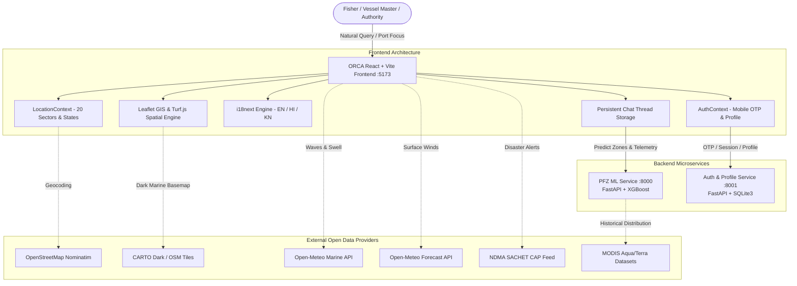

# ORCA / MIRA — Marine Intelligence and Reasoning Agent
**Autonomous Multi-Agent Ocean Intelligence, Potential Fishing Zone (PFZ) Advisory & Maritime Decision-Support Platform**

[](https://vitejs.dev/)
[](https://reactjs.org/)
[](https://fastapi.tiangolo.com/)
[](https://sqlite.org/)
[](https://xgboost.readthedocs.io/)
[](https://leafletjs.com/)
[](https://turfjs.org/)
[](https://www.i18next.com/)
[](https://github.com/RishitKapoorIT/MIRA-Marine-Intelligence-and-Reasoning-Agent/tree/Frontend)

---

## 🌊 Executive Platform Overview

**ORCA (Marine Intelligence)** — developed as **MIRA (Marine Intelligence and Reasoning Agent)** — is an end-to-end maritime intelligence and decision-support platform designed for artisanal fishers, commercial vessel operators, and coastal fisheries authorities across India.

Traditional maritime navigation tools force operators to mentally correlate disparate data: paper notices, radio broadcasts, static PDF advisories, and raw weather charts. ORCA transforms this experience into a unified, **explainable multi-agent workspace**:

1. **Conversational Multi-Agent Reasoning**: Users ask natural questions in plain language (*"weather report of my area"*, *"where are the best fishing zones near Odisha"*, *"is it safe to sail today"*).
2. **Dynamic Location Grounding**: The system grounds queries in the user's active profile **Safe House** harbor or dynamically geocodes coastal regions, states, and ports.
3. **Machine Learning PFZ Synthesis**: Computes real-time fishing zone probabilities using a trained **XGBoost classification model** analyzing satellite sea surface temperature (SST) thermal fronts and ocean color chlorophyll-a.
4. **Safety & Hazard Avoidance**: Displays real-time exclusion zones (55km cyclone boundaries, naval firing ranges) and calculates **hazard-avoiding navigational transit routes** with Turf.js.
5. **App-Wide Multilingual Support**: Fully localized in **English**, **Hindi (हिन्दी)**, and **Kannada (ಕನ್ನಡ)** with instant switching.
6. **Zero-Cost Free Data Guarantee**: Every data feed, map tile, and API is 100% free with no paid commercial licenses or billing accounts required.

---

## 🏗️ System Architecture & Data Flow



---

## ⚙️ Backend Microservices & API Specifications

ORCA runs two standalone, self-contained Python FastAPI backend microservices with zero external database dependencies (no PostgreSQL or cloud required).

### 1. PFZ Machine Learning API (`services/pfz-api` — Port 8000)
Serves machine learning predictions for Potential Fishing Zones using a trained gradient-boosted decision tree classifier.

* **Technology**: Python 3.10+, FastAPI, Uvicorn, XGBoost 2.1, NumPy, Scikit-Learn.
* **Trained Model**: `xgboost_skin_fishing_model.pkl`
  * Trained on empirical Indian coastal oceanographic features: `YEAR`, `latitude`, `longitude`, `month`, `temperature` (°C), `salinity` (PSU), `eastward_current` (m/s), `northward_current` (m/s), `current_speed` (knots), `chlorophyll` (mg/m³).
* **Feature Synthesis Engine**: `EnvironmentalFeatureGenerator` in `generator.py`
  * Synthesizes physical ocean variables using statistical distributions derived from historical MODIS Aqua satellite data, bounded by seasonal oceanic parameters.

#### Key Endpoints:
| Method | Endpoint | Description | Request Payload / Params |
|---|---|---|---|
| `GET` | `/health` | Health check & model status | Returns loaded model class and feature schema |
| `POST` | `/api/v1/predict/batch_coords` | Batch PFZ evaluation for candidate sites | `{ "center_lat": 12.91, "center_lon": 74.85, "count": 8 }` |
| `POST` | `/api/v1/predict/zone` | Diagnostic prediction for single coordinate | `{ "lat": 12.85, "lon": 74.70, "features": {...} }` |

* **Sample Response (`/api/v1/predict/batch_coords`)**:
  ```json
  {
    "status": "success",
    "total_evaluated": 8,
    "zones": [
      {
        "id": "PFZ-KA-01",
        "lat": 12.766,
        "lon": 74.829,
        "predicted_zone": "BEST",
        "probability": 0.942,
        "expected_species": "Indian Mackerel & Oil Sardine",
        "distance_nm": 9.2,
        "bearing": "190° S",
        "temperature": 30.49,
        "chlorophyll": 0.0778,
        "sector": "Sector 7"
      }
    ]
  }
  ```

---

### 2. Auth & User Profile API (`services/auth-api` — Port 8001)
Provides mobile OTP authentication, persistent session cookies, and user profile management (Safe House harbor, saved default route, optional Aadhaar verification, preferred language).

* **Technology**: Python 3.10+, FastAPI, Uvicorn, SQLite3 (`users.db`), Pydantic v2.
* **Storage**: Local SQLite database `users.db` created automatically on startup.
* **Session Management**: Dual authentication via HTTP-only persistent cookie (`orca_session`, 30 days expiry) and Bearer token in headers (`Authorization: Bearer <token>`).

#### Database Schema:
```sql
CREATE TABLE users (
    id TEXT PRIMARY KEY,
    phone TEXT UNIQUE NOT NULL,
    name TEXT,
    safe_house TEXT,         -- JSON: { lat, lon, label }
    safe_route TEXT,         -- JSON: { origin, destination, waypoint }
    aadhaar TEXT,            -- Optional identity verification
    preferred_language TEXT DEFAULT 'en',
    onboarding_completed INTEGER DEFAULT 0,
    created_at TEXT,
    updated_at TEXT
);

CREATE TABLE otp_tokens (
    phone TEXT PRIMARY KEY,
    otp TEXT NOT NULL,
    expires_at REAL NOT NULL
);
```

#### Key Endpoints:
| Method | Endpoint | Description | Details |
|---|---|---|---|
| `GET` | `/health` | Microservice & SQLite check | Returns online status |
| `POST` | `/api/v1/auth/request-otp` | Request 6-digit login OTP | In dev mode generates code `123456`, logs to console, returns `dev_otp` |
| `POST` | `/api/v1/auth/verify-otp` | Verify code & establish session | Validates code, creates new user or fetches existing, sets cookie, flags `is_new_user` |
| `GET` | `/api/v1/profile` | Retrieve active profile | Returns name, phone, safe house, safe route, language |
| `PUT` | `/api/v1/profile` | Update profile settings | Persists vessel master name, Safe House, Safe Route, Aadhaar, preferred language |
| `POST` | `/api/v1/auth/logout` | Revoke session | Deletes session cookie |

---

### 3. External Keyless APIs & Data Lineage

All external data sources operate **without API keys, billing accounts, or paid subscriptions**:

| Layer / Purpose | Provider | Endpoint URL | Parameters / Method |
|---|---|---|---|
| **Wave Height & Swell** | Open-Meteo Marine | `https://marine-api.open-meteo.com/v1/marine` | `latitude`, `longitude`, `hourly=wave_height,wave_direction,wave_period,swell_wave_height` |
| **Wind Speed & Direction** | Open-Meteo Forecast | `https://api.open-meteo.com/v1/forecast` | `latitude`, `longitude`, `current_weather=true,hourly=windspeed_10m,winddirection_10m` |
| **Coastal Hazards / Weather** | NDMA SACHET Feed | `https://sachet.ndma.gov.in/cap_public_website/FeedService` | Public CAP XML feed via CORS proxy + local fallback cache |
| **Port Search & Geocoding** | OpenStreetMap Nominatim | `https://nominatim.openstreetmap.org/search` | `format=json&countrycodes=in&q=<target>` with custom User-Agent |
| **Marine Maps Basemap** | OpenStreetMap / CARTO | `https://{s}.tile.openstreetmap.org/{z}/{x}/{y}.png` | Standard dark/ocean slippy tile map format |
| **EEZ Maritime Boundaries** | Marineregions.org | `public/data/india_eez.geojson` | Pre-bundled GeoJSON polygon for Indian 200nm boundary |

---

## 💻 Frontend Application Architecture

The frontend is a single-page application built with **React 18** and **Vite 5**, styled with custom **Tailwind CSS** marine tokens (`#0A0C0F` deep navy, `#00D8FF` cyan, `#30E8B8` seafoam green).

### 1. State Management & Context Architecture
* **[AuthContext.jsx](file:///r:/SIH_2.0/orca-app/src/context/AuthContext.jsx)**:
  * Manages user identity (`user`), authentication status (`isAuthenticated`), and token persistence.
  * Handles OTP verification, logout, profile updates, and a 1-click **`loginAsDemo()`** helper for instant testing.
  * Defaults unauthenticated visitors to `user = null` (no unauthorized auto-login).
* **[LocationContext.jsx](file:///r:/SIH_2.0/orca-app/src/context/LocationContext.jsx)**:
  * Manages the active focus harbor, coordinates, and coastal sector.
  * Registry of 20+ maritime locations and all Indian coastal states (**Odisha**, **Kerala**, **Karnataka**, **Maharashtra**, **Gujarat**, **Tamil Nadu**, **Andhra Pradesh**, **West Bengal**, **Goa**, **Andaman**).
  * Implements natural location parsing: queries like *"weather report of my area"*, *"how are waves here"*, or *"my place"* automatically resolve to the user's active harbor without needing rigid syntax.
* **Persistent Chat State**:
  * Stored in `localStorage` (`orca_chat_threads`, `orca_chat_messages_map`, `orca_active_thread_id`).
  * Switching tabs (**Chat ↔ Maps ↔ Analytics ↔ Profile**) preserves all conversation history and scroll position.

### 2. Application Modules & Routing (`App.jsx`)

| Route | View Component | Core Features |
|---|---|---|
| `/` | `WelcomePage.jsx` | Ocean landing page, regional status indicators, quick action navigation, language switcher. |
| `/chat` | `ChatPage.jsx` | Multi-agent reasoning conversational workspace. Dedicated cards for Weather/Swell, Hazards, Safe Routes, and PFZ Matrix. |
| `/maps` | `MapsPage.jsx` | Interactive full-screen Leaflet GIS map with toggleable layers (PFZ, Hazards, EEZ, Weather, SST, Chlorophyll). |
| `/pfz` | `PfzExplorationPage.jsx` | Ranked candidate fishing zones sortable by **Highest Yield**, **Nearest**, or **Safest**, with live Leaflet markers. |
| `/hazards` | `HazardsPage.jsx` | Real-time NDMA SACHET disaster warnings, 55km exclusion circle overlays, VHF Channel 16 emergency guidelines. |
| `/route` | `RoutePlanningPage.jsx` | Turf.js client-side marine routing engine with automated hazard collision detection and detour waypoints. |
| `/analytics`| `OceanAnalyticsPage.jsx` | Ocean environmental monitoring: live SST and Chlorophyll thermal gradient overlays, wave metrics, harbor switcher. |
| `/dashboard`| `AuthorityDashboardPage.jsx` | Coastal authority fleet dashboard: live vessel AIS tracking, SOS/EPIRB emergency alerts, district compliance meters. |
| `/profile` | `ProfilePage.jsx` | Manage Captain identity, Safe House harbor anchor, default safe route, optional Aadhaar, and language. |
| `/login` | `LoginPage.jsx` | Mobile phone login, 6-digit OTP verification, first-time vessel master onboarding wizard, active session card. |

---

## 🗺️ Geospatial & Mapping System

The platform's spatial intelligence is powered by **Leaflet 1.9.4**, **React-Leaflet 4.2.1**, and **Turf.js (@turf/turf)**.

### 1. Coordinate Systems & Projections
* **Internal Data Representation**: Standard **WGS 84 (`EPSG:4326`)** decimal degrees across all GeoJSON datasets, port coordinates, and ML API payloads.
* **Map Projection**: Projected automatically by Leaflet to **Spherical Mercator (`EPSG:3857`)** for smooth tile alignment.

### 2. Spatial Algorithms (Turf.js)
* **Great-Circle Trajectories**:
  * Generates geodesic arc waypoints between departure and destination harbors.
  * Calculates exact nautical distances (`turf.distance` in nautical miles) and compass bearings (`turf.bearing`).
* **Hazard Collision Detection**:
  * Represents cyclone watches and severe swell zones as polygon buffer circles (`turf.buffer` with 55km and 32km radii).
  * Evaluates intersection between the planned route polyline and hazard circles (`turf.lineIntersect`).
* **Automated Hazard Avoidance**:
  * When a collision is detected, the engine calculates an offset waypoint tangent to the hazard circle circumference, routing the vessel around danger zones.

### 3. Map Layering & Visualizations
* **Tile Layers**: Dark maritime raster tiles rendered over `#0e1822` deep oceanic canvas.
* **Vector Overlays**:
  * Translucent exclusion circles (Red `#EF4444` for cyclones, Amber `#F59E0B` for rough swell, Blue `#3B82F6` for naval firing practice).
  * GeoJSON polygon rendering of the 200-nautical-mile Exclusive Economic Zone (`india_eez.geojson`).
* **PFZ Marker System**:
  * Grade-based colored circular markers (Emerald for `BEST`, Cyan for `GOOD`, Amber for `POOR`).
  * Interactive popups displaying species, distance, SST, and a direct *"Plot Safe Route"* button.
* **Camera Animations**:
  * `MapController` hooks utilize `map.flyTo()` and `map.fitBounds()` to smoothly animate camera transitions when selecting zones or switching coastal regions.

---

## 🌐 Multilingual & Localization Architecture (`i18n`)

ORCA provides full app-wide localization to support Indian fishers in their native languages.

### 1. Engine & Implementation
* **Libraries**: `i18next` and `react-i18next`.
* **Configuration**: Initialized in `src/i18n/i18n.js`.
* **Supported Languages**:
  * **English (`en`)** — Default
  * **Hindi (`hi`)** — हिन्दी
  * **Kannada (`kn`)** — ಕನ್ನಡ

### 2. Storage & Dynamic Switching
* **Instant Switching**: Clicking the language selector buttons (`EN`, `HI`, `KN`) in the global header or welcome page immediately re-renders all text tokens across the application without reloading the page.
* **Dual Persistence**:
  1. Client-side in `localStorage.getItem('orca_language')`.
  2. Synced to the backend SQLite profile (`preferred_language`) so preferences persist across devices.

### 3. Locale Dictionary Structure
All translations live in `src/i18n/locales/` (`en.json`, `hi.json`, `kn.json`):
* `nav.*`: Header navigation tabs, buttons, and titles.
* `welcome.*`: Landing page hero headers, feature descriptions, and stats.
* `auth.*`: Login headings, phone labels, OTP prompts, and dev notices.
* `profile.*`: Identity fields, Safe House descriptions, Aadhaar notices, and save confirmations.
* `chat.*`: Agent pipeline labels, jump-to-scroll buttons, input placeholders.
* `analytics.*`: Metric cards, temperature scales, and telemetry citations.
* `hazards.*`: Emergency instruction modal, severity tags, and advisory text.
* `route.*`: Route planning headers, safety scores, and waypoint directions.
* `badges.*`: Standardized confidence badges (**Good catch chance**, **Moderate**, **Low**).

---

## ⚓ Safe House & User Profile System

The **Safe House** concept (introduced per Indian coastal fisheries requirements) serves as the anchor for vessel safety:

1. **GPS Denied Fallback**: When satellite GPS is denied, disabled, or inaccurate, the Safe House coordinates automatically provide the home anchor.
2. **Dynamic Context Provider**: Setting a Safe House in [ProfilePage.jsx](file:///r:/SIH_2.0/orca-app/src/components/profile/ProfilePage.jsx) automatically configures the default harbor, ocean analytics, weather forecast, and PFZ search area.
3. **Safe Route Pre-fill**: The user's saved default route (origin harbor to destination harbor) automatically pre-fills the route planner.
4. **Government Scheme Aadhaar**: An optional 12-digit Aadhaar identity field stored locally in encrypted form to qualify vessel operators for disaster relief funds and fuel subsidies without leaking data to third parties.

---

## 🛡️ Data Honesty & Safety Compliance (FR-C6)

In strict adherence to project requirements:
1. **No Simulated Data Presented as Live**: Where real-time satellite feeds require enterprise commercial subscriptions, UI elements are visibly labeled as **Sample / Simulated Telemetry**.
2. **PFZ Attribution**: All PFZ cards and advisories state plainly: *"via ORCA's own PFZ model over public satellite data (not an INCOIS-certified advisory)"*.
3. **Marine Routing Disclaimer**: Route alternatives generated via Turf.js are heuristic spatial solutions; they do not claim ECDIS or SOLAS navigation certification.

---

## ⚡ Quickstart & Local Execution Guide

### Prerequisites
* **Node.js**: v18.0.0 or higher (v20+ recommended)
* **Python**: 3.10 or higher (with pip)
* **Git**

---

### Step 1: Start the PFZ Machine Learning Service (Port 8000)

```bash
# Navigate to the PFZ API directory
cd services/pfz-api

# Create and activate a Python virtual environment
python -m venv venv
# On Windows (PowerShell):
venv\Scripts\Activate.ps1
# On macOS/Linux:
source venv/bin/activate

# Install dependencies
pip install -r requirements.txt

# Start the service on port 8000
python -m uvicorn main:app --host 127.0.0.1 --port 8000 --reload
```
* **Health Check**: Visit `http://127.0.0.1:8000/health` (returns `status: online`, `model_loaded: true`).
* **API Documentation**: Visit `http://127.0.0.1:8000/docs`.

---

### Step 2: Start the Auth & Profile Service (Port 8001)

In a second terminal:

```bash
# Navigate to the Auth API directory
cd services/auth-api

# Activate the virtual environment
# On Windows (PowerShell):
..\..\venv\Scripts\Activate.ps1
# On macOS/Linux:
source ../../venv/bin/activate

# Install dependencies
pip install -r requirements.txt

# Start the service on port 8001
python -m uvicorn main:app --host 127.0.0.1 --port 8001 --reload
```
* **Health Check**: Visit `http://127.0.0.1:8001/health` (returns `status: online`, `db: sqlite3`).
* **API Documentation**: Visit `http://127.0.0.1:8001/docs`.

---

### Step 3: Start the Frontend Application (Port 5173)

In a third terminal:

```bash
# Navigate to the frontend directory
cd frontend

# Install Node dependencies
npm install

# Launch Vite development server
npm run dev
```

Open **`http://127.0.0.1:5173`** in your browser to launch ORCA.

---

### Step 4: Verifying Production Build

```bash
cd frontend
npm run build
```
Builds cleanly to `dist/` with 0 bundling errors.

---

## 👨‍💻 Git Workflow & Commit History

All development is maintained directly on the **`Frontend`** branch of [`RishitKapoorIT/MIRA-Marine-Intelligence-and-Reasoning-Agent`](https://github.com/RishitKapoorIT/MIRA-Marine-Intelligence-and-Reasoning-Agent/tree/Frontend):

```
8c26f5e fix(chat): persist threads across tab switches, support natural location queries, and add dedicated weather & hazard responses
c4c68ed feat(auth): fix new user login flow, remove auto-login, add onboarding and demo shortcuts
2be8817 feat(update3): implement Brief 3 fixes, SQLite auth backend, i18n switching, and sector zoning
ae62ef4 feat(dashboard): implement regional authority dashboard and fleet registry
c98b00d feat(analytics): implement ocean analytics and dual heatmaps
457a3e9 feat(route): implement safe route planning with Turf.js hazard avoidance
87b69cc feat(hazards): implement safety and hazard view with exclusion zones
ca44a5d feat(pfz): implement PFZ exploration with Nearest/Yield/Safety filters
cee6899 feat(chat): implement conversational workspace, agent pipeline, and evidence cards
3537a02 feat(frontend): scaffold React+Vite app shell, config, and base components
3fcef23 feat(backend): stand up FastAPI PFZ prediction service with XGBoost model
```

---

*Built with ❤️ for the Smart India Hackathon (SIH).*
